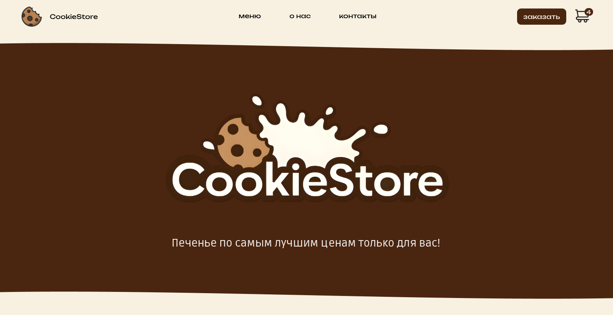

# CookieStore
Интернет-магазин печенья 



## 🔗 Ссылки

- [Сайт проекта](http://82.202.141.106)

## 🛠 Используемые технологии

### Frontend
- **React** 
- **TypeScript** 
- **Redux Toolkit** 
- **React Router** 
- **Vite**
- **SCSS**

### Backend
- **Golang**
- **PostgreSQL** 
- **Minio** 
- **Docker** 

## Ключевые решения

### Корзина на клиенте
- Корзина товаров хранится в **Redux store** и синхронизируется с **localStorage**
- Данные о товарах загружаются с сервера только при необходимости

### Адаптивный дизайн
- Полная адаптация под все устройства (от 300px до 1400px+)

### Конфигурация
- Docker Compose
- Nginx 

## 📋 Возможности проекта

- ✅ Каталог товаров с фильтрацией и поиском
- ✅ Карточки товаров с подробной информацией
- ✅ Корзина покупок
- ✅ Оформление заказа 
- ✅ Адаптивный дизайн для всех устройств
- ✅ Система уведомлений 
- ✅ Копирование контактов в буфер обмена
- ✅ Синхронизация между вкладками с помощью localstorage

## 🚀 Запуск проекта

### Production (Docker Compose)

```bash
# Клонирование репозитория
git clone <repository-url>
cd CookieStore

# Запуск всех сервисов (Frontend, Backend, PostgreSQL)
docker-compose -f docker-compose.prod.yml up -d

# Остановка сервисов
docker-compose -f docker-compose.prod.yml down
```
### Development

#### Backend

```bash
cd server

# Запуск сервера на 8090 порту
go run cmd/server/main.go
```

#### Frontend

```bash
# Из корня проекта

# Установка зависимостей
npm install

# Запуск dev сервера
npm run dev

# Production сборка
npm run build
```