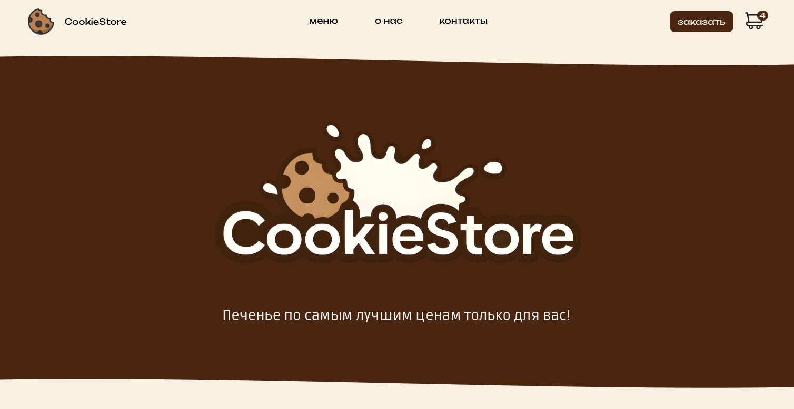

# CookieStore
Интернет-магазин печенья 



## Ссылки

- [Сайт проекта](https://cookok.ru)
- [API документация](https://cookok.ru/api-docs)

## Используемые технологии

### Frontend
- **React** 
- **TypeScript** 
- **Redux Toolkit** 
- **React Router** 
- **Vite**
- **SCSS**
- **Axios**

### Backend
- **Node.js** + **Express**
- **TypeScript**
- **MongoDB** 
- **MinIO** 
- **Swagger** (API документация)
- **Docker** + **Nginx** 

## Ключевые решения

### Корзина на клиенте
- Корзина товаров хранится в **Redux store** и синхронизируется с **localStorage**
- Данные о товарах загружаются с сервера только при необходимости

### API и документация
- RESTful API с полной Swagger документацией
- Доступна по адресу `/api-docs`

### Deployment
- Docker Compose для оркестрации сервисов
- Nginx для проксирования и раздачи статики
- MinIO для хранения изображений
- MongoDB для хранения данных 

## Возможности проекта

- Каталог товаров с фильтрацией и поиском
- Карточки товаров с подробной информацией
- Корзина покупок
- Оформление заказа с валидацией
- Форма обратной связи
- Адаптивный дизайн для всех устройств
- Система уведомлений (alerts)
- Синхронизация корзины между вкладками через localStorage

## Запуск проекта

### Переменные окружения

#### Frontend (.env в корне проекта)
```env
VITE_API_URL=<URL вашего API, например https://yourdomain.com>
VITE_DOMAIN=<ваш домен, например yourdomain.com>
```

#### Backend (server/.env)
```env
# Server Configuration
PORT=<порт сервера, например 8080>
NODE_ENV=<окружение: development или production>

# Domain Configuration
DOMAIN=<ваш домен для production>
PROTOCOL=<протокол: http или https>

# MongoDB Configuration
MONGO_USER=<пользователь MongoDB>
MONGO_PASSWORD=<пароль MongoDB>
MONGO_HOST=<хост MongoDB: mongo для Docker, localhost для dev>
MONGO_PORT=<порт MongoDB, обычно 27017>
MONGO_DB=<название базы данных>

# MinIO Configuration
MINIO_ENDPOINT=<хост MinIO: minio для Docker, localhost для dev>
MINIO_PORT=<порт MinIO, обычно 9000>
MINIO_ROOT_USER=<пользователь MinIO>
MINIO_ROOT_PASSWORD=<пароль MinIO>
MINIO_BUCKET=<название bucket для хранения изображений>
```

### Production (Docker)

```bash
# Клонирование репозитория
git clone https://github.com/OlegWhiteRose/CookieStore.git
cd CookieStore

# Настройка переменных окружения
# Создайте .env в корне проекта и server/.env согласно примерам выше

# Установка зависимостей и сборка фронтенда
npm install
npm run build

# Запуск всех сервисов (MongoDB, MinIO, Server, Nginx)
cd server
npm install
npm run deploy
```

**Обновление статики:**
```bash
# 1. Соберите фронтенд (из корня проекта)
npm run build

# 2. Загрузите папку dist на сервер в корень проекта

# 3. Перезапустите nginx (из папки server)
npm run update
```

### Development

#### Backend

```bash
cd server

# Установка зависимостей
npm install

# Создайте .env согласно примеру выше (используйте localhost для хостов)

# Запуск MongoDB и MinIO через Docker
docker compose -f docker/docker-compose.yml up mongo minio -d

# Заполнение базы данных
npm run seed

# Запуск dev сервера с nodemon
npm run dev

# Сервер запустится на указанном порту
# API документация: http://localhost:8080/api-docs
```

#### Frontend

```bash
# Из корня проекта

# Установка зависимостей
npm install

# Создайте .env согласно примеру выше

# Запуск dev сервера
npm run dev

# Production сборка
npm run build
```

## API Документация

После запуска сервера документация доступна по адресу `/api-docs`
